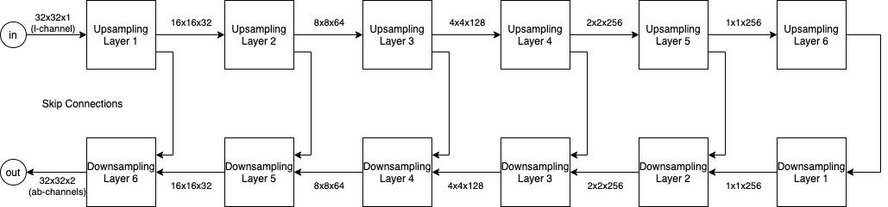
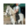
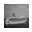
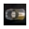

# Grayscale Image Colorizations using GANs

This project uses a Generative Adversarial Network to colorize grayscale images.

The training dataset used is the CIFAR-10 dataset.

## Background

Typically, the input to the generator model is pseudorandomly produced noise. Here,
the input to the generator is the grayscale image, and the output should be a
colorized version of the grayscale image.

This implementation is loosely based on the **Pix2Pix conditional GAN model**.

- The generator applies some function (that is learned via training) to the input
  grayscale image producing an image that is intended to be the colorized version
  of the input image.

- The discriminator compares this output image and the corresponding color image
  (the ground truth) from the dataset and attempts to classify the image as real
  or generated.

In the Pix2Pix model, a 3-channel input to both, the generator, and the
discriminator, produces a 3-channel output. Here, the CIELAB color space is used
to represent images. Hence 1 channel is enough to represent the grayscale image,
and 2 channels are enough to represent all the color information.

## Implementation

### Generator Architecture

The generator is a series of encoders (upsamplers) and decoders (downsamplers).

### Discrimator Architecture

The discriminator is a Convolutional Neural Network with a softmax output (for classification).

### The Training Process

## Results

Here are some good results (on the test part of the dataset)

| Grayscale                                                               | Ground Truth                                                            | Colorized                                                                |
| ----------------------------------------------------------------------- | ----------------------------------------------------------------------- | ------------------------------------------------------------------------ |
|  |  |  |
|  |  |  |
|  |  |  |
|  |  |  |
|  |  |  |
|  |  |  |

And some cases, where the model did not work

| Grayscale                                                                | Ground Truth                                                                          | Colorized                                                                 |
| ------------------------------------------------------------------------ | ------------------------------------------------------------------------------------- | ------------------------------------------------------------------------- |
|  |  |  |
|   |                |   |
|  |               |  |
|  |               |  |

## References

- Phillip Isola, Jun-Yan Zhu, Tinghui Zhou, and Alexei A. Efros. Image-to-image translation with
  conditional adversarial networks. CoRR, abs/1611.07004, 2016. URL http://arxiv.org/abs/
  1611.07004.
- Mahesh Agrawal and Kartik Sawhney. Exploring convolutional neural networks for automatic image
  colorization. Technical report.
- Kamyar Nazeri, Eric Ng, and Mehran Ebrahimi. Image colorization using generative adversarial
  networks. Lecture Notes in Computer Science, page 85–94, 2018. ISSN 1611-3349. doi: 10.1007/
  978-3-319-94544-6_9. URL http://dx.doi.org/10.1007/978-3-319-94544-6_9.
- Richard Zhang, Phillip Isola, and Alexei A. Efros. Colorful image colorization. CoRR,
  abs/1603.08511, 2016. URL http://arxiv.org/abs/1603.08511.
- Jun-Yan Zhu, Taesung Park, Phillip Isola, and Alexei A. Efros. Unpaired image-to-image translation
  using cycle-consistent adversarial networks. CoRR, abs/1703.10593, 2017. URL http://arxiv.
  org/abs/1703.10593.
